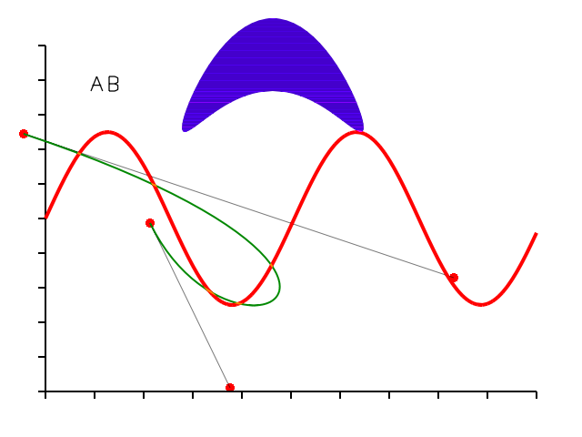

# Feather

A 2D graphics library for CPU-based rendering with a focus on sub-pixel accuracy out of the box (a.k.a. my own version of AGG).

**Figure 1.** An eclectic assortment 2D graphics drawn with Feather. Yes, meaningless, but look at those smooth, antialiased edges!

Depends on [libtb](https://github.com/tobybell/libtb).

## License

This software is [unlicensed](LICENSE). You may not use, redistribute, or create derivative works from this software without my permission.
